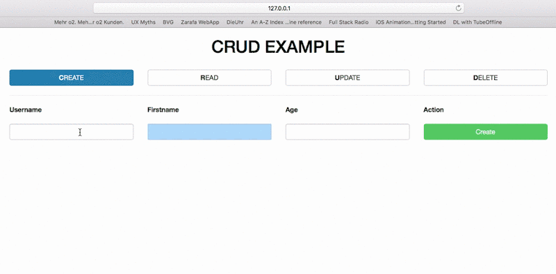

# CRUD (Create, Read, Update, Delete)


# Want to build it by your own?
[Tutorial: Build CRUD from scratch.](documentation/tutorial)

# Just want to set this project up?
## Environment
System Requirements | Version |  | Used Packages | Version |
------------ | ------------- | ------------- | ------------- | ------------- |
macOS | Sierra |  | vapor | 2.0.x |
swift | 3.1 |  | postgresql-provider | 2.x |
vapor-toolbox | 2.0.3 |

<center>- TESTED AND ASSURED TO WORK WITH ABOVE VERSIONS - </center>

## 0. Install PostgreSQL via Homebrew
```bash
# install the binary
$ brew install postgresql

# init it
$ initdb /usr/local/var/postgres

# start the postgres server
$ postgres -D /usr/local/var/postgres
```

## 1. Generate xcode project and open it
##### <b>Directory:</b> crud-example/
Execute in your command line
```bash
$ vapor xcode -y
```

## 2. Set your database configuration
##### <b>File:</b> crud-example/Config/secrets/postgresql.json
Change my user `martinlasek` to yours and choose a database name
```JSON
{
  "hostname": "127.0.0.1",
  "user": "martinlasek",
  "password": "",
  "database": "crudexample",
  "port": 5432
}
```

## 3. Create the database
##### <b>Directory:</b> <i>doesn't matter</i>
Execute in your command line
```bash
$ createdb crudexample;
```

## 4. Build and Run
##### <b>Application:</b> Xcode
Make sure before you hit the ► button, that you selected <b> Run </b> Scheme to the right of the button. <br>
<i>From this</i> <br>

<br> <i>To this</i> <br>


## 5. Open in Browser
##### <b>Application:</b> Your favorite browser
Call `127.0.0.1:8001/` or `127.0.0.1:8001/read`

## 6. Additional
##### <b>Directory:</b> crud-example/Config
Add the `secrets` directory to `.gitignore` if you are using git :)
